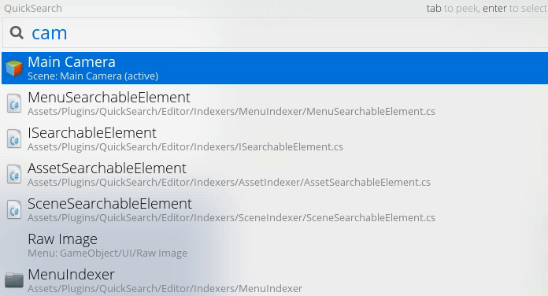

# QuickSearch

A Command Palette for Unity, built with :heart:

<p align="center">
  
</p>

## Features
- Search Assets
- Search GameObjects on Active Scenes
- Execute Menu
- Support Asset Dragging

## Requirements
Unity >= 5.2.2

## Installation
#### - with [unity-packman](https://github.com/appetizermonster/unity-packman)

```bash
unity-packman install appetizermonster/Unity3D-QuickSearch
```

#### - or Asset Package
Download [latest package](https://github.com/appetizermonster/Unity3D-QuickSearch/raw/master/packages/latest.unitypackage)

## Usage
Press <kbd>Ctrl</kbd> + <kbd>,</kbd> on Windows, <kbd>Shift</kbd> + <kbd>`</kbd> on macOS

## Credits
- Blur Background  
  <https://medium.com/@jimfleming/translucent-editor-windows-in-unity3d-b21778c04de9>
- Builtin Asset Icons  
  <http://answers.unity3d.com/questions/792118/what-are-the-editor-resources-by-name-for-editorgu.html>
- Center EditorWindow  
  <http://answers.unity3d.com/questions/960413/editor-window-how-to-center-a-window.html>

## License
MIT
